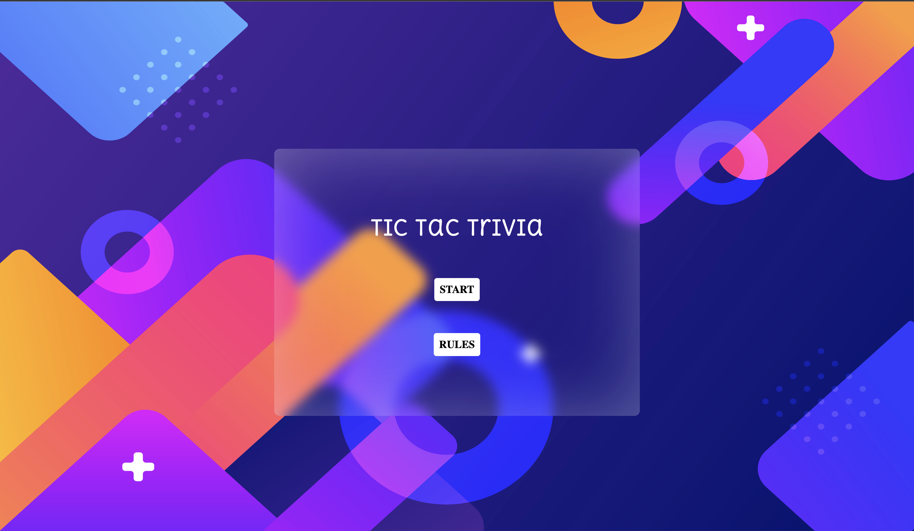

# Tic-Tac-Trivia

Tic Tac Toe is a classic game that has been enjoyed for generations, and now it can be played online using HTML, CSS, and JavaScript.In this version of the game, a 3x3 grid is displayed on the screen, and players take turns placing either an "X" or an "O" in a square. The first player to get three in a row - either vertically, horizontally, or diagonally - wins the game.

